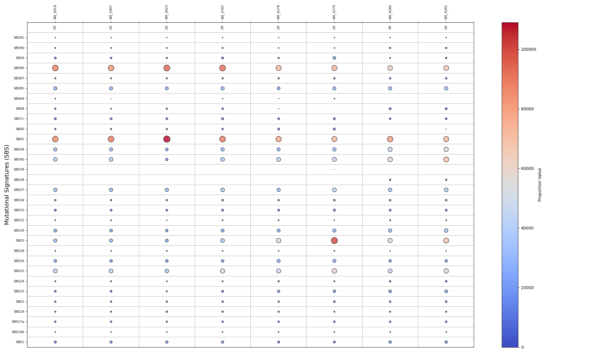
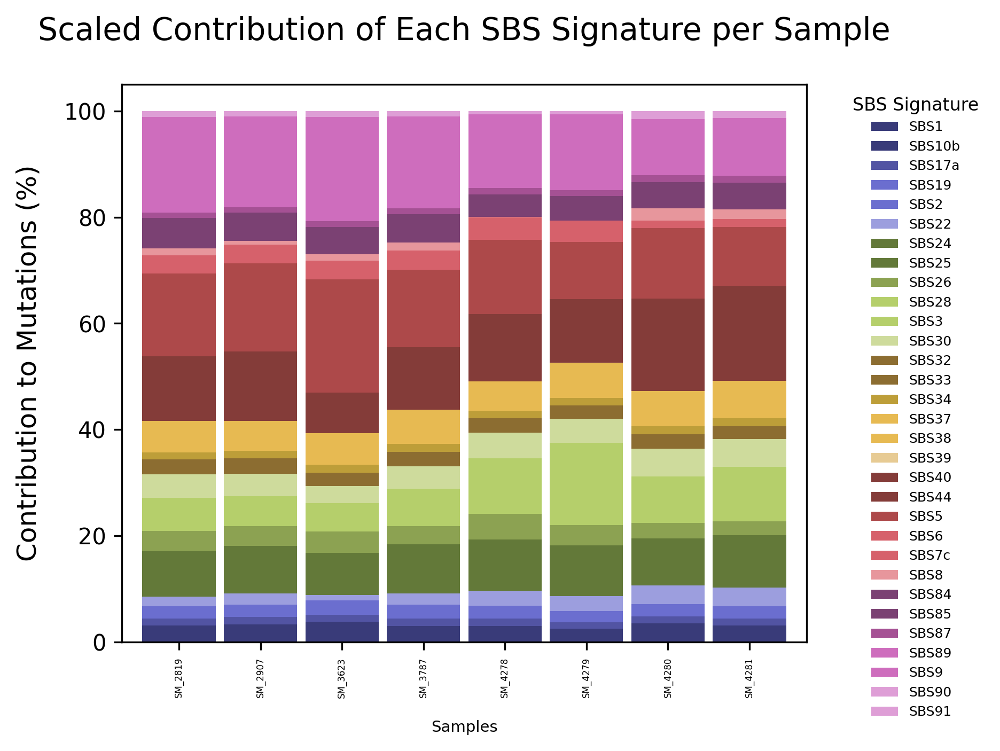
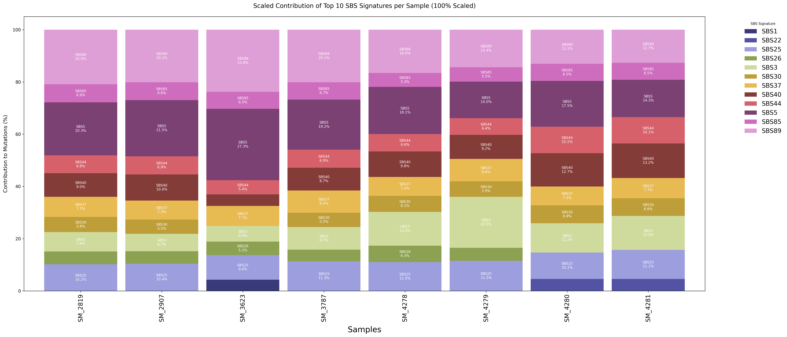

# OncoSignTrack Pipeline

OncoSignTrack is a fully automated and user-friendly computational pipeline designed for high-throughput analysis of mutational signatures. It processes VCF files, extracts mutational signatures, and integrates COSMIC annotations, offering comprehensive insights into tumor aetiology and genomic alterations.

## Implementation

The pipeline is constructed using a **modular design**, allowing components to be added, removed, or replaced without disrupting the workflow. This approach enables **customization** based on research objectives and facilitates seamless **integration** with existing bioinformatics tools.

### **Technology Stack**
OncoSignTrack is implemented using **Python, R, and Bash**, leveraging the strengths of each language for robust and flexible genomic data analysis:

- **Python:** Primary language for **data visualization and mutational signature extraction**.
  - **Libraries used:** `pandas`, `matplotlib`, `seaborn`, `numpy`
- **R:** Used for **genomic data wrangling and analysis**.
  - **Required packages:** `ggplot2`, `BiocManager`, `BSgenome.Hsapiens.NCBI.GRCh38`, `MutationalPatterns`, `vcfR`, `VariantAnnotation`
- **Bash:** Controls the execution of different components.
- **bedtools:** Used to **filter shared variants** and **exclude common variations** based on user-defined allele frequency thresholds.

The pipeline is optimized for **reproducibility** and **scientific rigor**, with built-in **error handling** that detects, logs, and resolves issues at each stage, ensuring streamlined genomic data analysis.

## Command-Line Options

| **Flag** | **Description** | **Required?** |
|---------|-------------|--------------|
| `-d, -D, --directory` | Path to VCF directory | ✅ **Yes** |
| `-f, -F, --allele-frequency` | Allele frequency threshold | ❌ **Optional** |
| `-b, -B, --bed-file` | BED file to exclude shared variants | ❌ **Optional** |
| `-v, -V, --visualize` | Generate visualizations | ❌ **Optional** |
| `-e, -E, --etiology` | Extract COSMIC etiology info | ❌ **Optional** |
| `-h, -H, --help` | Display help message | ❌ **Optional** |

## Features

- **Automated variant filtering**: Identifies non-frequent SNPs using `hg38` or `hg37`.
- **Allele frequency calculation**: Extracts real **allele frequency (AF)** from **allele depth (AD)** values.
- **COSMIC annotation integration**: Retrieves and organizes **mutational signatures** based on **COSMIC database**.
- **Visualization tools**: Generates **heatmaps, stacked bar charts, and boxplots** for easy interpretation.
- **Scalability**: Supports **large-scale genomic studies**, ensuring reproducible analysis.

## Installation

To ensure a smooth installation of **OncoSignTrack**, follow the steps below to set up a dedicated environment and install all required dependencies.

```bash
# 1. Set up a Conda/Mamba environment
# Using Conda:
conda create -n oncosigntrack_env python=3.9 -y
conda activate oncosigntrack_env

# OR Using Mamba (faster alternative to Conda):
mamba create -n oncosigntrack_env python=3.9 -y
mamba activate oncosigntrack_env

# 2. Install Python dependencies
pip install numpy pandas matplotlib seaborn

# 3. Install Bedtools
conda install -c bioconda bedtools

# 4. Install R and required packages
# If R is not installed, install it first using Conda:
conda install -c conda-forge r-base

# Install required R packages
R -e "install.packages(c('ggplot2', 'BiocManager', 'vcfR', 'VariantAnnotation'))"
R -e "BiocManager::install(c('BSgenome.Hsapiens.NCBI.GRCh38', 'MutationalPatterns'))"

```
## Usage

To run OncoSignTrack, use the following command-line options:

```bash
./OncoSignTrack_pipeline.sh -h
 -d, -D, --directory <path>         Specify the destination folder containing VCF files. (Required)
  -f, -F, --allele-frequency <value> Set the allele frequency threshold. (Optional)
  -b, -B, --bed-file <file>          Specify the BED file to exclude shared variants. (Optional)
  -v, -V, --visualize                Generate graphs to compare mutational signatures among samples. (Optional)
  -e, -E, --etiology                 Extract mutational signature etiology from the COSMIC database. (Optional)
  -h, -H, --help                     Display this help message.
```

## Example Visualization

Here are some examples of a mutational signature visualization in OncoSignTrack pipeline:





## Example of a Log File Generated for Extracting the Required SBS Information from the COSMIC Dataset
✅ Found SBS1 at https://cancer.sanger.ac.uk/signatures/sbs/sbs1
📄 Saved SBS1 page as SBS1.html
SBS1 Aetiology: An endogenous mutational process initiated by spontaneous or enzymatic deamination of 5-methylcytosine to thymine which generates G:T mismatches in double stranded DNA. Failure to detect and remove these mismatches prior to DNA replication results in fixation of the T substitution for C. 
***Comments: Signature SBS1 is clock-like in that the number of mutations in most cancers and normal cells correlates with the age of the individual. Rates of acquisition of Signature SBS1 mutations over time differ markedly between different cancer types and different normal cell types. These differences correlate with estimated rates of stem cell division in different tissues and Signature SBS1 may therefore be a cell division/mitotic clock.

SBS1 Second Aetiology: Spontaneous deamination of 5-methylcytosine

SBS1 Associated Signatures: The activity of SBS1 is closely correlated with the activity of SBS5 within many types of cancer. However, between cancer types, mutation burdens of SBS1 and SBS5 do not clearly correlate consistent with them being due to different underlying processes.

------------------------------------------------------------------------------------------------------------------------
✅ Found SBS22 at https://cancer.sanger.ac.uk/signatures/sbs/sbs22
📄 Saved SBS22 page as SBS22.html
SBS22 Aetiology: Aristolochic acid exposure. Found in cancer samples with known exposures to aristolochic acid and the pattern of mutations exhibited by the signature is consistent with that observed in experimental systems of aristolochic acid exposure.

SBS22 Second Aetiology: Aristolochic acid exposure

SBS22 Associated Signatures: Unknown

------------------------------------------------------------------------------------------------------------------------
✅ Found SBS25 at https://cancer.sanger.ac.uk/signatures/sbs/sbs25
📄 Saved SBS25 page as SBS25.html
SBS25 Aetiology: Unknown. However, some Hodgkin’s cell line samples in which the signature has been found were from patients exposed to chemotherapy and it is possible that SBS25 is due to chemotherapy treatment. 
***Comments: This signature has only been identified in Hodgkin’s cell lines. Data is not available from primary Hodgkin lymphomas.

SBS25 Second Aetiology: Unknown chemotherapy

SBS25 Associated Signatures: Unknown

------------------------------------------------------------------------------------------------------------------------
✅ Found SBS26 at https://cancer.sanger.ac.uk/signatures/sbs/sbs26
📄 Saved SBS26 page as SBS26.html
SBS26 Aetiology: Defective DNA mismatch repair. 
***Comments: SBS26 is one of seven mutational signatures associated with defective DNA mismatch repair and microsatellite instability (MSI) and is often found in the same samples as other MSI associated signatures: SBS6 , SBS14 , SBS15 , SBS20 , SBS21 , and SBS44 .

SBS26 Second Aetiology: MMR deficiency

SBS26 Associated Signatures: SBS26 is associated ID1 and ID2 .

------------------------------------------------------------------------------------------------------------------------
✅ Found SBS3 at https://cancer.sanger.ac.uk/signatures/sbs/sbs3
📄 Saved SBS3 page as SBS3.html
SBS3 Aetiology: Defective homologous recombination-based DNA damage repair which manifests predominantly as small indels and genome rearrangements due to abnormal double strand break repair but also in the form of this base substitution signature. 
***Comments: SBS3 is strongly associated with germline and somatic BRCA1 and BRCA2 mutations and BRCA1 promoter methylation in breast, pancreatic, and ovarian cancers. In pancreatic cancer, responders to platinum therapy usually exhibit SBS3 mutations. Together with associated indel and rearrangement signatures, SBS3 has been proposed as a predictor of defective homologous recombination-based repair and thus of response to therapies exploiting this repair defect.

SBS3 Second Aetiology: HR deficiency

SBS3 Associated Signatures: Associated with ID6 , characterised by small deletions of >5bp with extended stretches of overlapping microhomology at breakpoint junctions. Also associated with signatures DBS13 , CN17 , and SV3 , as well as short tandem duplications (1-10kb), longer tandem duplications (>100kb), and deletions (1-10kb).

------------------------------------------------------------------------------------------------------------------------
✅ Found SBS30 at https://cancer.sanger.ac.uk/signatures/sbs/sbs30
📄 Saved SBS30 page as SBS30.html
SBS30 Aetiology: SBS30 is due to deficiency in base excision repair due to inactivating mutations in NTHL1 .

SBS30 Second Aetiology: BER deficiency

SBS30 Associated Signatures: Unknown

------------------------------------------------------------------------------------------------------------------------
✅ Found SBS37 at https://cancer.sanger.ac.uk/signatures/sbs/sbs37
📄 Saved SBS37 page as SBS37.html
SBS37 Aetiology: Unknown.

SBS37 Second Aetiology: Unknown

SBS37 Associated Signatures: Unknown

------------------------------------------------------------------------------------------------------------------------
✅ Found SBS40 at https://cancer.sanger.ac.uk/signatures/sbs/sbs40
📄 Saved SBS40 page as SBS40.html
SBS40 Aetiology: Unknown. 
***Comments: Numbers of mutations attributed to SBS40 are correlated with patients’ ages for some types of human cancer.

SBS40 Second Aetiology: Unknown

SBS40 Associated Signatures: Unknown

------------------------------------------------------------------------------------------------------------------------
✅ Found SBS44 at https://cancer.sanger.ac.uk/signatures/sbs/sbs44
📄 Saved SBS44 page as SBS44.html
SBS44 Aetiology: Defective DNA mismatch repair. 
***Comments: SBS44 is one of seven mutational signatures associated with defective DNA mismatch repair and microsatellite instability (MSI) and is often found in the same samples as other MSI associated signatures: SBS6 , SBS14 , SBS15 , SBS20 , SBS21 , and SBS26 .

SBS44 Second Aetiology: MMR deficiency

SBS44 Associated Signatures: SBS44 is associated with ID1 and ID2 .

------------------------------------------------------------------------------------------------------------------------
✅ Found SBS55 at https://cancer.sanger.ac.uk/signatures/sbs/sbs55
📄 Saved SBS55 page as SBS55.html
SBS55 Aetiology: Possible sequencing artefact.

SBS55 Second Aetiology: Possible sequencing artifact

SBS55 Associated Signatures: Unknown

------------------------------------------------------------------------------------------------------------------------
✅ Found SBS85 at https://cancer.sanger.ac.uk/signatures/sbs/sbs85
📄 Saved SBS85 page as SBS85.html
SBS85 Aetiology: Indirect effects of activation-induced cytidine deaminase (AID) induced somatic mutagenesis in lymphoid cells. 
***Comments: SBS85 is found in clustered mutations in the immunoglobulin gene and other regions in lymphoid cancers.

SBS85 Second Aetiology: AID activity

SBS85 Associated Signatures: Associated with SBS84 .

------------------------------------------------------------------------------------------------------------------------
✅ Found SBS89 at https://cancer.sanger.ac.uk/signatures/sbs/sbs89
📄 Saved SBS89 page as SBS89.html
SBS89 Aetiology: Unknown. 
***Comments: SBS89 appears to be most active in the first decade of life.

SBS89 Second Aetiology: Unknown

SBS89 Associated Signatures: SBS89 correlates with DBS8 , suggesting that they are due to the same underlying mutational process.

------------------------------------------------------------------------------------------------------------------------

## License

OncoSignTrack is licensed under the Apache License, Version 2.0.
You may obtain a copy of the License at:
[http://www.apache.org/licenses/LICENSE-2.0](http://www.apache.org/licenses/LICENSE-2.0)

Unless required by applicable law or agreed to in writing, software distributed under the License is distributed on an "AS IS" basis, without warranties or conditions of any kind, either express or implied. See the License for the specific language governing permissions and limitations under the License.
